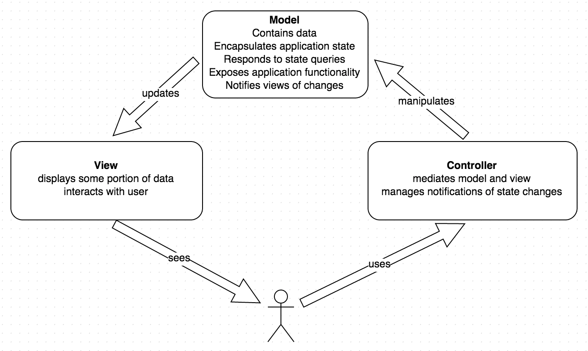
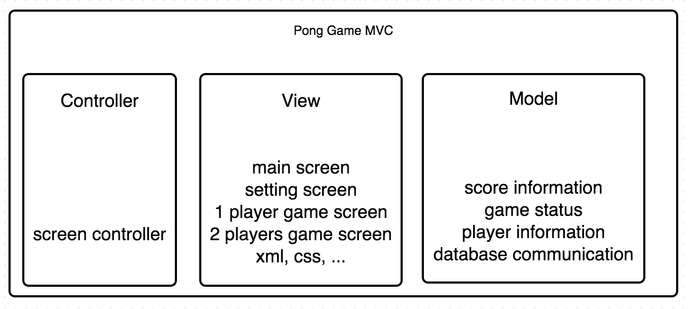
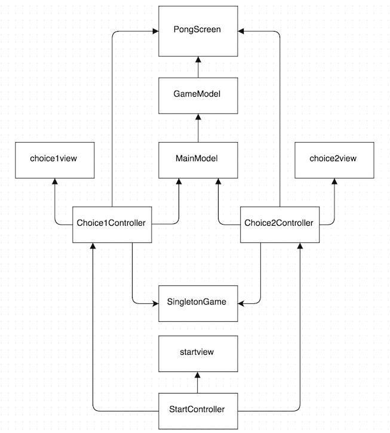

Pong Game
==

Design patterns:

Singleton pattern
--

- In software engineering, singleton pattern is a design pattern that restricts the instantiation of a class to one object.
    - useful when exactly one object is needed to coordinate actions across the system.
    - used when system operate more efficiently if only one object exists.
- The Abstract Factory pattern can use Singletons in its implementation.

Implementation:
- must satisfy single instance and global access.
- can only create one object.
- creating a class with a method that creates a new instance of the class if one does not exist. 
- return a reference to the object, if an instance already exists.

```java
    public class SingletonGame {
        private static Game instance = null;
    
        private SingletonGame() {
        }
    
        public static Game getInstance(Context context, AttributeSet attributeSet) {
            if (instance == null) {
                instance = new Game(context, attributeSet);
            }
            return instance;
        }
    }
    
    public class MainModel {
        private static GameController instance = null;

        public static GameController getInstance() {
            if (instance == null) {
                instance = new GameController();
            }
            return instance;
        }
    }
```

Singleton pattern in Pong Game:
- do not need to create a new instance when player pause the game
- use the same object to ensure the game continual after the pause.
- easier to handle and manage data by use only one instance
- only need build one Game in Pong
- only need one GameController for Pong, and it is easier to update data.

Observer pattern
--
The observer pattern is a software design patter:
- an object, called the subject, maintains a list of its dependents
    - called observers, and notifies them automatically of any state changes    - usually by calling one of their methods 
    - mainly used to implement distributed event handling systems.
    - Observer pattern is a key part in Model View Controller architectureal pattern.
    - observer pattern is implemented in almost all GUI toolkits.

Template method pattern
--
template method pattern is a behavioral design pattern
- defines the program skeleton of an algorithm in a method, called template method, which defers some stops to subclasses.
- it lets one redefine certain steps of an algorithm without changing the algorithm's structure.
- one or more algorithm steps can be overridden by subclasses to allow differing behaviors while ensuring that the overarching algorithm is still followed.
- abstract methods

MVC pattern
--
Model View controller (MVC) is a software architectural pattern for implementing user interfaces.
It divides a given software application into three interconnected parts.



MVC architectural pattern in Pong Game:



######Advantages:
- easier to maintain, edit, change, update functions
- easier to reuse the code
- divide the work in part, easier to make a implement plan or work with others.

######Disadvantages:
- difficult to divide
- some part might be easier to implement with out divide.
- extral work are needed for a small application
- performance issue, may cause performance decrease for small application which do not need divide out many part and run extra objects ...

Architectural pattern vs Design pattern
--
####Architectural pattern
- reusable solution to a commonly occuring problem in software architecture within a given context.
- similar to software design patterns, but have a broader scope.
- architectural pattern address various issues in software engineering:
    - computer hardware performance limitations
    - high availability & minimization of a business risk.
    - some architecutral patterns have been implemented within software frameworks.
- Even though an architectural pattern conveys an image of a system, it is not an architecture.
    - An architectural pattern is a concept that solves and delineates some essential cohesive elements of a software architecture. 
- Patterns are often defined as 'strictly described and commonly available.'

####Design pattern
a formal way of documenting a solution to a design problem in a particular field of expertise.
- a pattern must explain why a particular situation causes problems
- and why the proposed solution is considered a good one.
- A pattern would not tell the designer how many windows to put in the room
-   instead, it would propose a set of values to guide the designer toward a decision that is best for their particular application.
- A pattern must also explain when it is applicable. 
- A design pattern must be broad enough to apply to different situations.
- The range of situations in which a pattern can be used is called context.
- The context must be documentated within the pattern.

#####architectural pattern:
- Model View Controller

#####design pattern:
- Observer pattern
- State pattern 
- Template Method pattern
- Abstract Factory pattern
- Pipe and filter pattern

Class Diagram
--

